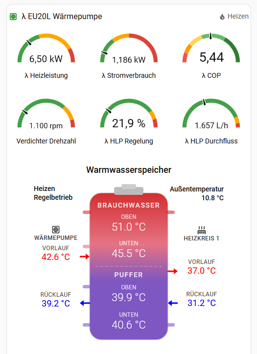
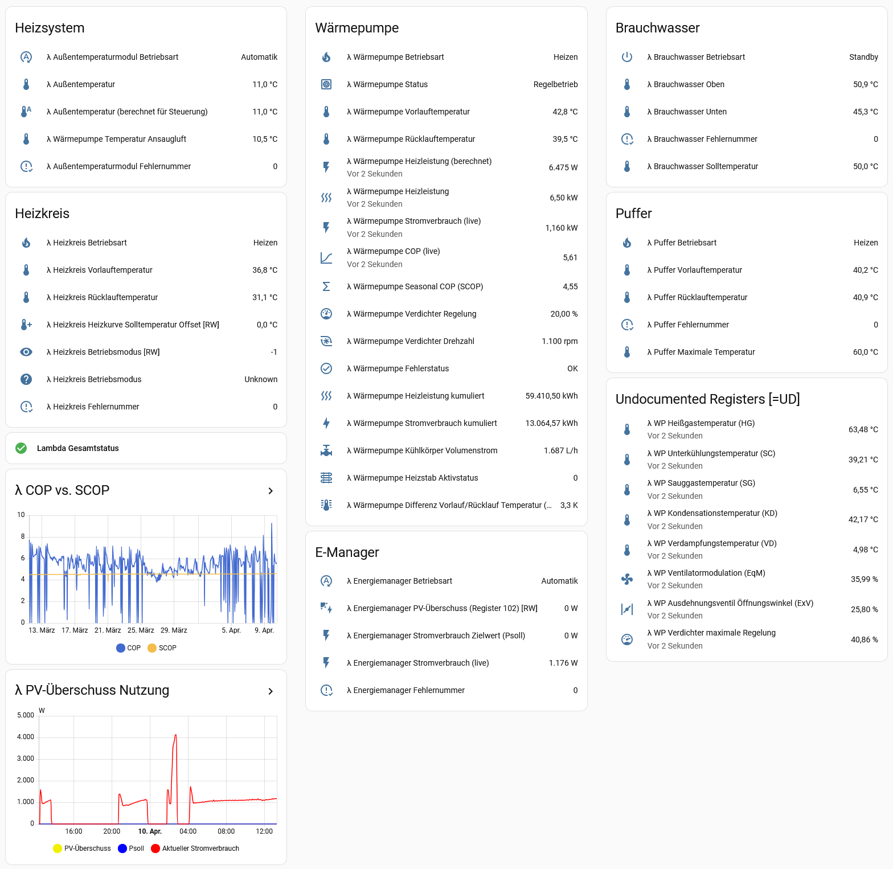
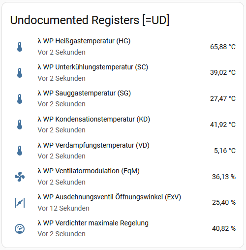
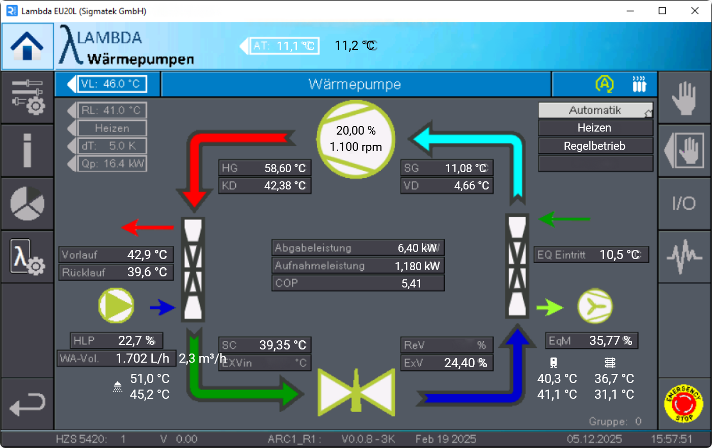

### Lambda EU-L Series
**Home Assistant Modbus TCP**

<br clear="left"/>

**YAML package to integrate Lambda EU-L series air/water heat pumps into Home Assistant via native Modbus TCP.**

---

## Compatible Heat Pumps

This package was developed and validated on the Lambda EU20L, but the
Modbus register map is identical across the entire Lambda EU-L series: **EU08L, EU13L, EU15L and EU20L**.

Only the physical heating capacity differs — the register block layout, scaling, data types and enumerations are shared between all models. Renaming the Modbus hub name (and optionally the `EU20L …` sensor name prefixes) is all that is needed to run the same package on a different EU-L model.

Based on the official [Lambda Modbus specification](https://www.lambda-wp.at/fileadmin/userdaten/docs/downloads/regler/Modbus-Beschreibung-und-Protokoll.pdf) dated **2025-02-13**.


## Features

- **Full register coverage of 6 Lambda modules** — Ambient, E-Manager, Heat Pump 1, Boiler 1, Buffer 1, Heating Circuit 1
- **61 Modbus sensors** with correct `device_class`, `state_class`, `unit_of_measurement`, `scale` and `precision`
- **8 additional undocumented register sensors** (hot gas, subcooling, suction gas, condensation, evaporation, expansion valve opening angle, VdA max rating, EqM rating) — identified by Modbus scan and matched against the Lambda control panel
- **9 state-mapping template sensors** rendering the numeric state registers as plain German panel text plus matching MDI icons
- **4 calculated template sensors**: SCOP, flow/return ΔT, calculated heating power (`flow × ΔT × 1.163`), and the deviation between reported and calculated heating power
- **3 climate entities** exposing the heating curve offset, domestic hot water thermostat and room thermostat as regular HA climate tiles
- **Energy Dashboard ready** — accumulated energy counters (registers 1020 and 1022) use `total_increasing` and are already scaled to kWh
- **Separate optional helpers** (`helpers.yaml`) for compressor speed in rpm, IMP NMT MAX II circulation pump control percentage, and a collective fault binary sensor
- **Ready-to-use Lovelace dashboard card** with 6 gauges, heat pump state badge and an SVG buffer-tank visualization

## What's Different

Several other Lambda heat pump projects already exist for Home Assistant
(see [Related Projects](#related-projects) at the bottom). This package is
based on the initial work of [@RalfWinter](https://github.com/RalfWinter/lambda-heatpump-modbus-tcp-HA),
includes the ideas and suggestions of [@thecem](https://github.com/thecem)
and was built with the following goals in mind:

1. **Pure YAML, no custom component.** Uses the built-in Home Assistant
   Modbus integration — no HACS dependency, no additional Python code,
   no risk of breakage on Home Assistant updates, works on every current HA version.
   Pure YAML also makes customization straightforward: adding a second
   heating circuit, an additional buffer tank or a second boiler is a
   copy-paste of the existing register block with adjusted register
   addresses.
2. **Undocumented registers 1025–1032 covered:** hot gas, subcooling,
   suction gas, condensation, evaporation, expansion valve opening angle,
   VdA max rating and EqM rating.
3. **Complete HA metadata on every sensor.** `device_class`, `state_class`,
   `unit_of_measurement`, `scale` and `precision` are set for every entity,
   so long-term statistics, Energy Dashboard integration and history graphs
   work out of the box, without any manual configuration in the HA UI.
4. This package also assigns a `unique_id` to every entity — without `unique_id`
   Home Assistant does not allow entities to be customized from the UI
   (changes such as renaming, changing units or icons etc. are not permitted then), so unique IDs are essential for
   a complete YAML definition to provide a seamless user experience.
5. **Units are rescaled at the Modbus layer**, not stacked on top via
   templates. Accumulated counters are exposed directly in kWh (instead of
   seven-digit Wh values) and the inverter power in kW. Downstream systems
   (evcc, Power Flow Card, Energy Dashboard) get sane values without needing additional wrapper
   templates.
6. **Climate entities for RW registers.** Heating curve offset, domestic hot
   water thermostat and room thermostat are exposed as native HA climate
   tiles — not just read-only sensors.
7. **Dashboard included.** SVG buffer-tank visualization and gauges ship as
   ready-to-use Lovelace YAML — other projects are backend-only.

## Requirements

- Home Assistant (any current version with the built-in [Modbus integration](https://www.home-assistant.io/integrations/modbus/) activated)
- A Lambda EU-L series heat pump with firmware that exposes the Modbus TCP interface
- A network connection between HA and the Lambda controller (Ethernet)
- Default Modbus TCP port: **502**

> **Firmware note (V1.1.3):** Owners with firmware V1.1.3 have reported that
> the word order of `int32` registers has been changed. If your accumulated
> energy counters (1020, 1022) show nonsense values, add `swap: word` to those
> sensor definitions. See the inline comment at the top of
> `lambda_heatpump.yaml`.

## Installation

1. Copy `lambda_heatpump.yaml` (and optionally `helpers.yaml`) to `/config/packages/`
2. Ensure packages are enabled in `configuration.yaml`:
   ```yaml
   homeassistant:
     packages: !include_dir_named packages
   ```
3. Adjust the Lambda controller IP address in the YAML:
   ```yaml
   host: 192.168.2.6  # ← CHANGE: IP of your Lambda controller
   ```
4. Optionally rename the Modbus hub name (`EU20L`) and the `EU20L …` sensor
   name prefix if you run a different EU-L model
5. Restart Home Assistant

> **Language:** Entity names, comments and template descriptions are in
> English. Panel-facing terminology (state mappings, climate entity names) is
> deliberately kept in German because the Lambda is primarily sold in German-speaking countries.

## Dashboard Card (optional)

The file `dashboard_card.yaml` contains a ready-to-use Lovelace card with
gauges for heating power, electrical power consumption, COP, compressor speed,
heat-load-pump (HLP) control percentage and HLP flow rate. A custom
button-card renders the buffer tank as an SVG with live temperature readings.

<p align="center">
  
</p>

**Usage:** Paste the contents of `dashboard_card.yaml` as a manual card (YAML)
in the dashboard editor.

> **Helper dependency:** The gauges for compressor speed (rpm) and HLP control
> percentage reference template sensors that live in `helpers.yaml`. Install
> `helpers.yaml` together with the dashboard card or remove those two gauges.

The following dashboard lists all entities plus long-term trends for COP/SCOP
and PV surplus in one Dashboard view:

<p align="center">
  
</p>

### Required HACS Cards

| HACS Card | Purpose | HACS Search |
|---|---|---|
| [**Vertical Stack In Card**](https://github.com/ofekashery/vertical-stack-in-card) | Outer container without borders | `vertical-stack-in-card` |
| [**card-mod**](https://github.com/thomasloven/lovelace-card-mod) | CSS styling (remove borders, colors) | `card-mod` |
| [**button-card**](https://github.com/custom-cards/button-card) | SVG buffer-tank visualization | `button-card` |

Without these cards the dashboard card will not render correctly. The Modbus
YAML itself works independently.

## Undocumented Registers (Heat Pump 1)

Eight additional registers exist in the 1025-1032 range that are **not**
documented in the official Lambda Modbus specification. They were identified
by a full Modbus scan and match many of the values visible on the Lambda
control panel (at user level 2 or higher). Column "Panel Label" lists the corresponding
German panel term so they can be cross-checked.

> ⚠️ Use at your own risk. No guarantee that the register assignments are
> correct on every firmware version. Lambda intends to keep them, though. 

| Register | Sensor | Unit | Panel Label |
|---|---|---|---|
| 1025 | VdA Max Rating | % | VdA (Verdichteranlage Max. Rating) |
| 1026 | Hot Gas Temperature | °C | HG (Heißgas) |
| 1027 | Subcooling Temperature | °C | SC (Unterkühlung) |
| 1028 | Suction Gas Temperature | °C | SG (Sauggas) |
| 1029 | Condensation Temperature | °C | KD (Kondensation) |
| 1030 | Evaporation Temperature | °C | VD (Verdampfung) |
| 1031 | EqM Rating | % | EqM (Energiequellen-Modulation) |
| 1032 | Expansion Valve Opening Angle | % | ExV (Öffnungswinkel) |

<p align="center">
  
</p>

## Climate Entities

Three `modbus.climates` entries expose RW registers as HA climate tiles so
that temperatures and offsets can be adjusted directly from the dashboard.

| Entity | Read Register | Write Register | Range |
|---|---|---|---|
| λ Heizkurve Solltemperatur Offset | 5050 | 5050 | −5.0 … +5.0 K |
| λ Brauchwasser-Thermostat | 2002 | 2050 | 45 … 54 °C |
| λ Raum-Thermostat | 5004 | 5051 | 15 … 35 °C |

## Entity Reference

See [entities.md](entities.md) for a complete mapping of registers to entity
names, units, device classes and state mappings.

## Optional Helpers

`helpers.yaml` contains three template helpers that are commonly useful but
kept out of `lambda_heatpump.yaml` because they depend on specific hardware
choices or display preferences:

1. **Compressor speed (rpm)** — derived from register 1010, assumes 5500 rpm = 100 %
2. **Heat charge pump (HLP) control %** — piecewise-linear interpolation from
   register 1006 (heat sink volume flow) to the control percentage of an
   **IMP NMT MAX II** circulation pump. The calibration points were measured
   empirically and do **not** apply to other pump models.
3. **`Lambda Sammelstörung`** — a `binary_sensor` of `device_class: problem`
   that turns on if any of the six Lambda error number registers reports a
   non-zero value.

The dashboard card references the first two helpers. If you do not use an
IMP NMT MAX II pump, either remeasure the curve or remove the HLP gauge.

### Planned

Template sensors for **JAZ / MAZ / TAZ** (yearly / monthly / daily COP) are
planned but not yet included because they depend on a longer chain of
`utility_meter` helpers and integration helpers that are not part of this
package. Contributions welcome.

## Additional Fun Project: Recreation of the Lambda Service Panel

If you want, you can recreate the native Lambda Sigmatek service panel as a
Lovelace view inside Home Assistant. Now that every relevant register is
exposed via Modbus, nearly all the values the physical control panel shows are
available as HA entities, so a pixel-accurate recreation using the
`picture-elements` dashboard card becomes feasible.

The screenshot below is the original Lambda Sigmatek HMI as it appears on
the desktop client — the recreation aims to mirror it as closely as possible:

<p align="center">
  
</p>

Two files in this repo make this a drop-in addition:

- **`service_panel_card.yaml`** — a `picture-elements` Lovelace card with all
  state labels positioned over the panel background image
- **`images/lambda_panel_background.png`** — the cleaned background screenshot
  of the original Lambda Sigmatek HMI

**Installation:**

1. Copy `images/lambda_panel_background.png` to `/config/www/` so it is served
   at `/local/lambda_panel_background.png`
2. Create a new dashboard view of type **Sidebar** (or any view that gives the
   card enough horizontal space — the panel image has a fixed aspect ratio)
3. Add a manual card and paste the contents of `service_panel_card.yaml`

> **Fine-tuning:** browser zoom level, screen resolution and font rendering
> all affect where each label lands on the background image. After installation
> you can edit the card directly in the dashboard UI and adjust the `left`,
> `top` and `font-size` values of every element (e.g., `left: 50%`,
> `top: 29.2%`, `font-size: 2.2vmin`) until everything lines up cleanly in your
> environment.

> **Optional:** the YAML reserves a slot for an external flow-rate entity
> (e.g., from a circulation pump such as the IMP NMT MAX II, or the HLP
> regulation percentage). It is commented out at the bottom of the file —
> uncomment and point it at any flow-rate sensor you have available.

## Documentation

- [Lambda Modbus specification (PDF)](https://www.lambda-wp.at/fileadmin/userdaten/docs/downloads/regler/Modbus-Beschreibung-und-Protokoll.pdf) — official Lambda Wärmepumpen Modbus description and protocol, dated 2025-02-13
- Reverse-engineered register mappings for the undocumented registers 1025-1032 (thanks to [@thecem](https://github.com/thecem)) documented inline in `lambda_heatpump.yaml`

## Related Projects

Other Lambda heat pump projects for Home Assistant:

- [`RalfWinter/lambda-heatpump-modbus-tcp-HA`](https://github.com/RalfWinter/lambda-heatpump-modbus-tcp-HA) — early basic YAML package
- [`GuidoJeuken-6512/lambda_heat_pumps`](https://github.com/GuidoJeuken-6512/lambda_heat_pumps) — HACS custom component
- [`floriansProjects/lambda-heatpump-homeassistant`](https://github.com/floriansProjects/lambda-heatpump-homeassistant) — YAML package paired with Grafana dashboards and a Shelly Pro 3EM for cross-checked energy metering
- [`route662/Lambda-Heatpump`](https://github.com/route662/Lambda-Heatpump) — alternative HACS custom Python component

## License

[MIT](LICENSE)
